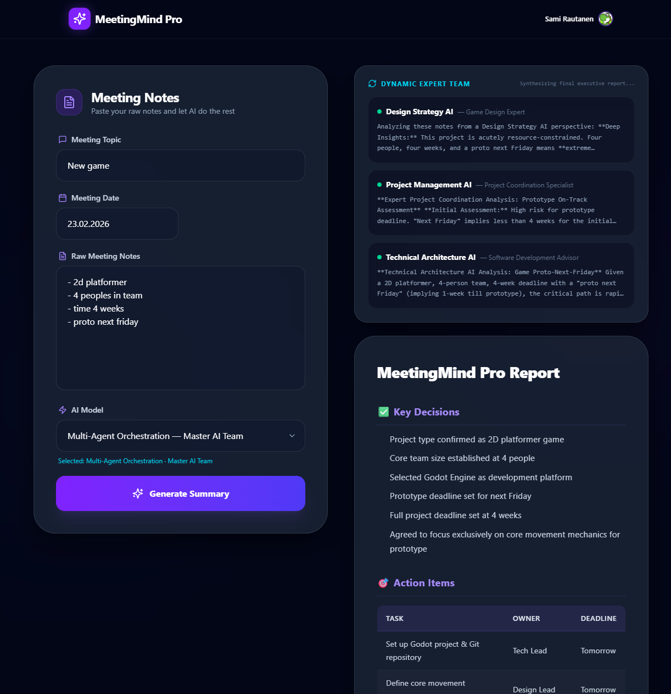

# 🤝 MeetingMind Pro — Enterprise AI Meeting Intelligence



**MeetingMind Pro** is a high-performance SaaS application designed to transform raw, unstructured meeting notes into professional, actionable summaries. It leverages state-of-the-art LLMs via **OpenRouter**, featuring real-time reasoning visualization and cross-model performance tracking.

---

## 🏗️ Technical Architecture

The application is built on a **Unified Container Architecture**, optimized for cost-effective deployment on **AWS App Runner**.

- **Frontend**: Next.js 16.1.6 (Pages Router) using Static HTML Export for maximum performance.
- **Backend**: FastAPI (Python 3.12) serving both the API and the static frontend assets.
- **AI Integration**: Unified OpenRouter interface supporting Gemini, Claude, GPT-4o, and DeepSeek.
- **Security**: Robust JWT-based authentication via **Clerk**.
- **Communication**: Server-Sent Events (SSE) for low-latency, real-time token streaming.

### Project Structure
```text
.
├── api/                # FastAPI Backend
│   └── server.py       # Core logic, SSE streaming & Auth
├── pages/              # Next.js Frontend
│   └── product.tsx     # Main AI Dashboard & SSE Client
├── docs/               # Technical documentation & guides
├── public/             # Static assets
├── Dockerfile          # Multi-stage production build
└── requirements.txt    # Python dependencies
```

---

## 🧠 AI Engineering Features & How to Use the App

When using the MeetingMind Pro dashboard, you can choose between **Two Execution Modes** from the model dropdown menu. These modes demonstrate different approaches to AI engineering:

### Mode 1: Single Model Execution (Direct Inference)
Select any standard model from the dropdown (e.g., `Gemini 2.5 Flash`, `Claude 3.5 Sonnet`, `DeepSeek R1`). 
- **How it works:** The system extracts your raw meeting notes and sends them directly to the chosen model using a single, comprehensive system prompt.
- **Why use it:** Perfect for testing how different models handle the exact same prompt. You can compare the formatting, logic, and speed (latency) of standard models vs. reasoning models (like DeepSeek R1, which natively streams its chain-of-thought).

### Mode 2: Multi-Agent Orchestration ("Master AI")
Select `"Multi-Agent Orchestration (Master AI)"` from the dropdown. 
- **How it works:** This hands over the control to an agency of LLMs rather than a single model. The system intelligently routes tasks between different models based on their strengths (orchestrated by the backend).
- **Why use it:** Demonstrates advanced enterprise-grade AI patterns. The user doesn't need to know which model is best—the system handles the cognitive load.

### 2. Transparent Reasoning (CoT)
One of the core portfolio highlights is the **Real-Time Cognitive Process** view. The system parses specific reasoning tokens from the SSE stream and renders them in a dedicated terminal-style UI, allowing users to see the AI's internal logic before the final output.

### Deep Dive: How the LLM Mesh (Mode 2) Works
When you select the Multi-Agent mode, the backend automatically triggers a sophisticated 3-stage orchestration:
1. **Master Orchestrator (GPT-4o)**: Analyzes the raw notes and dynamically defines exactly 3 expert personas tailored to the specific meeting's context (e.g., if it's a tech meeting, it might spawn a "DevOps Expert" and "Product Manager").
2. **Expert Analysis (Gemini 2.5 Flash)**: The 3 generated agents perform parallel, focused deep-dives from their unique perspectives. Gemini Flash is used here for its high speed and low cost.
3. **Synthetic Finalization (Claude 3.5 Sonnet)**: A Lead Facilitator agent reads the insights from all 3 experts along with the original notes, synthesizing them into the final, cohesive executive-level report. 
- **Real-time Visualization**: Users can monitor this entire team creation and individual agent analyses streaming live through a dedicated UI panel before the final report is generated.

### 4. Observability & Latency Tracking
The backend tracks end-to-end processing time for every request, providing visibility into model performance and latency metrics directly in the UI.

---

##  Future Roadmap & Enterprise Strategy
Designed with scalability and cost-efficiency in mind, the platform is ready for the next level of Agentic Workflows:
- **Cost-Optimized Routing**: Implementation of a "Router Agent" to dynamically select models based on context length and task complexity (e.g., Flash models for simple notes, Gemini 3.1 Pro for massive technical documentation).
- **Autonomous Quality Verification (Self-Correction)**: Integrating a "Reviewer Agent" to perform a critique-and-refine loop on agent outputs before final synthesis.
- **Future-Ready Architecture**: The LLM Mesh is model-agnostic, allowing seamless hot-swapping to Gemini 3.1 Pro or future O1 reasoning models without breaking the orchestration logic.
- **RAG Integration**: Connecting meeting intelligence to a Vector Database for cross-meeting context and historical decision tracking.

---

## �️ Security & Authentication

Security is "Secure by Default":
- **Clerk Integration**: Full user lifecycle management.
- **JWT Validation**: The FastAPI backend validates every incoming request's Bearer token against Clerk's JWKS.
- **API Cost Controls**: Hard credit limits ($15/mo) set at the OpenRouter level with Auto-Topup disabled to ensure public demo safety.
- **Environment Isolation**: Secure handling of API keys and environment-specific bypasses for local development.

---

## 🚀 Installation & Local Development

### Prerequisites
- Docker Desktop
- OpenRouter API Key
- Clerk Publishable & Secret Keys

### Environment Setup
Create a `.env` file in the root:
```env
OPENROUTER_API_KEY=sk-or-v1-...
CLERK_JWKS_URL=https://.../.well-known/jwks.json
NEXT_PUBLIC_CLERK_PUBLISHABLE_KEY=pk_test_...
ENVIRONMENT=development
```

### Building the Unified Container
Next.js static export requires the Clerk Publishable Key at build time for prerendering. Use the following command in PowerShell:

```powershell
# Extract key from .env and build
$env:NEXT_PUBLIC_CLERK_PUBLISHABLE_KEY = (Get-Content .env | Select-String "^NEXT_PUBLIC_CLERK_PUBLISHABLE_KEY=").ToString().Split("=")[1]; `
docker build --build-arg NEXT_PUBLIC_CLERK_PUBLISHABLE_KEY=$env:NEXT_PUBLIC_CLERK_PUBLISHABLE_KEY --platform linux/amd64 -t meetingmind-pro .
```

### Running Locally
```powershell
docker run -p 8000:8000 --env-file .env meetingmind-pro
```
Access the application at `http://localhost:8000`.

---

## ☁️ Deployment

The project is optimized for **AWS App Runner**:
1. Build the Docker image for `linux/amd64`.
2. Push to **Amazon ECR**.
3. Deploy as a service to App Runner, mapping port `8000`.

For detailed migration steps, see [docs/vercel-to-aws-migration.md](./docs/vercel-to-aws-migration.md).

---

**Developed by**: Sami Rautanen  
**Positioning**: AI Engineer / SaaS Multi-Model Platform 🚀
